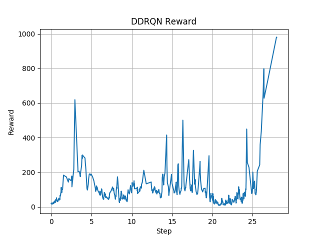

# CartPole\_tf

[Demo Video](https://youtu.be/gYLcy0vGwfE)

Solving the CartPole (Inverted Pendulum) Problem with Reinforcement Learning.

Implemented in ternsorflow. The most advanced version currently lives in [main\_rnn.py](main_rnn.py),

where a DDRQN (Double-Dueling-Recurrent-Q-network) Agent optimizes for the problem.

